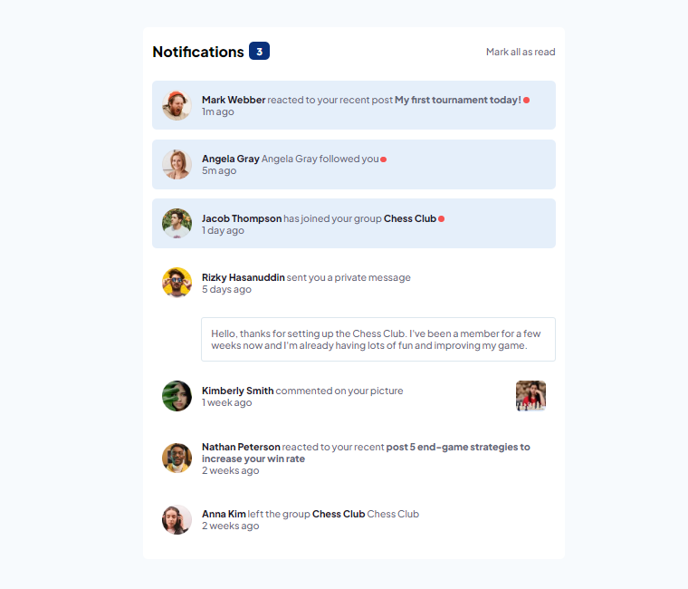

# Frontend Mentor - Notifications page solution

This is a solution to the [Notifications page challenge on Frontend Mentor](https://www.frontendmentor.io/challenges/notifications-page-DqK5QAmKbC). Frontend Mentor challenges help you improve your coding skills by building realistic projects. 

## Table of contents

- [Overview](#overview)
  - [The challenge](#the-challenge)
  - [Screenshot](image.png)
  - [Links](#links)
- [My process](#my-process)
  - [Built with](HTML+CSS+JS)
  - [What I learned](About-js-and-css-styling)
- [Author](Zain-Asif)

## Overview

### The challenge

Users should be able to:

- Distinguish between "unread" and "read" notifications
- Select "Mark all as read" to toggle the visual state of the unread notifications and set the number of unread messages to zero
- View the optimal layout for the interface depending on their device's screen size
- See hover and focus states for all interactive elements on the page

### Screenshot

### Links

- Solution URL: [Add solution URL here](https://your-solution-url.com)
- Live Site URL: [Add live site URL here](https://your-live-site-url.com)

## My process
-Customizing HTML, CSS and JS

### Built with

- Semantic HTML5 markup
- CSS custom properties
- Flexbox
- CSS Grid
- Mobile-first workflow
- [React](https://reactjs.org/) - JS library
- [Next.js](https://nextjs.org/) - React framework
- [Styled Components](https://styled-components.com/) - For styles

### Continued development

I am still learning different new CSS styles and more JS functions.

### Useful resources

- [resource 1](https://developer.mozilla.org/en-US/) - This helped me for multiple reasons. I really recommend it to anyone still learning HTML CSS or JS.

## Author

- Website - [Zain Asif](www.github.com/zainasif767)
- Frontend Mentor - [@yzainasif767](https://www.frontendmentor.io/profile/ZainAsif767)
- LinkedIn - [Zain-Asif](https://www.linkedin.com/in/zain-asif-614337233)

## Acknowledgments

A YT video guide helped me with channel nammed as "JavaScipt Front".

